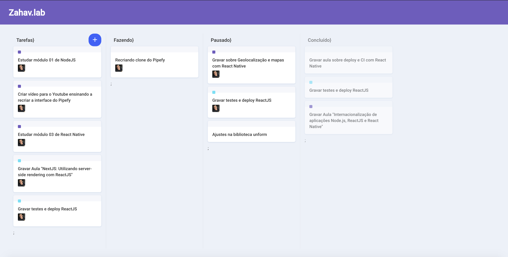

# Clone de Inteface Pipefy - ReactJS

Interface Clone de aplicação em ReactJS - Pipefy.

ReactJS 16.9.0

Dependências.
<li>
<ul>immer</ul>
<ul>react</ul>
<ul>react-dnd</ul>
<ul>react-dnd-html5-backend</ul>
<ul>react-dom</ul>
<ul>react-icons</ul>
<ul>react-scripts</ul>
<ul>styled-components</ul>
</li>

Iniciar aplicação:

yarn install
yarn start

# Estudo RocketSeat

 By: <a href="https://www.linkedin.com/in/douglas-morais-35640684/">Douglas Morais </a> 
